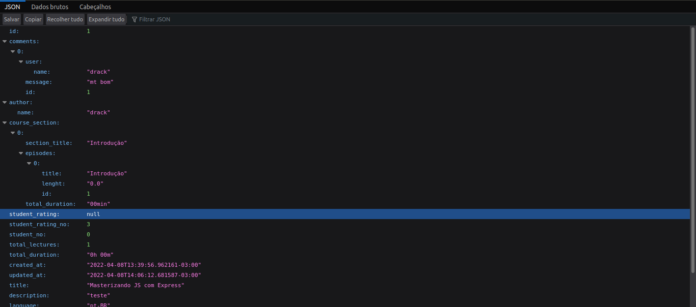
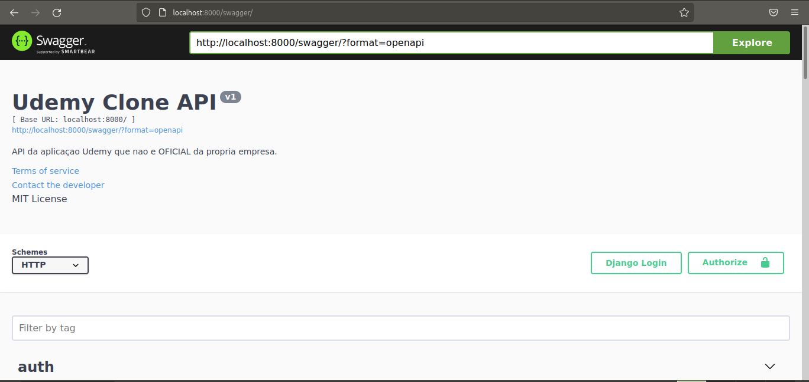

  
<div align="center">    
 <h1>🎯 Udemy Clone API</h1> </div>    
 <br>    
 <div align="center">    
 <a href="#sobre">Sobre</a> | <a href="#tecnologias">Tecnologias</a> | <a href="#run">Rodando o projeto</a> </div>    
 <a id="sobre"></a>    
    
Teste de em realizar a regra de negocio do serviço de cursos Udemy em Django, essa aplicação faz parte do ecossistema que ira atuar junto com o Frontend.    
    
<div align="center">    
 <strong>Tela de uma requisição JSON de cursos</strong>    
  </div>    
 <div align="center">    
 <strong>Tela do Swagger da API</strong>    
  </div>    
 <a id="tecnologias"></a>    
    
## :computer: Tecnologias    
 O projeto foi desenvolvido usando as tecnologias:    
    
<div align="center">    
     
     
     
     
  </div>    
 <a id="run"></a>    
    
## :running: Rodando o projeto    
 ### 💻 Pré-requisitos    
 Antes de começar, verifique se você atendeu aos seguintes requisitos:    
    
- Você instalou a versão mais recente de `< Docker/ Python>` - Você tem uma máquina `< Windows / Linux / Mac >`.    
- Você possui um `< Editor de código ou IDE / Gerenciador de banco de dados >`.    
    
## ☕ Pequena ajuda    
 Preencha o arquivo `.env.example` com as informações cobradas e depois renomeie para `.env`.    
    
```env
SECRET_KEY=
DEBUG=
HOSTS=

# POSTGRES
POSTGRES_DB=
POSTGRES_USER=
POSTGRES_PASSWORD=

# PGADMIN
PGADMIN_DEFAULT_EMAIL=
PGADMIN_DEFAULT_PASSWORD=

# STRIPE
STRIPE_API_KEY=
ENDPOINT_SECRET=

# Cloudinary
CLOUDINARY_CLOUD_NAME=
CLOUDINARY_API_KEY=
CLOUDINARY_API_SECRET=

```    
 ## Serviços necessarios antes de rodar a aplicaçao:    
 Lembre-se de pegar as suas chaves de API nos serviços da **[Cloudinary](https://www.googleadservices.com/pagead/aclk?sa=L&ai=DChcSEwjl49bn4oX3AhXPQUgAHdW8AFAYABAAGgJjZQ&ohost=www.google.com&cid=CAASJeRoZficLapyBYRC5pWQ6cgFAKUh-DeA2yIPtwULbUZEPsb5Evg&sig=AOD64_3SQrHCVZaf9Ts2mVKRuoGkzAm4Dw&q&adurl&ved=2ahUKEwid3c7n4oX3AhWArJUCHbZRAH4Q0Qx6BAgDEAE)** e do **[Stripe](https://www.googleadservices.com/pagead/aclk?sa=L&ai=DChcSEwijlrD54oX3AhUvQUgAHQb7CAsYABAAGgJjZQ&ohost=www.google.com&cid=CAASJeRopwqWu91WWsvPhM4UKeVdBrRdLP22hWD2ajMnUqih0kZrdnc&sig=AOD64_0Ww0E5pwd2EtlWshd1Y1RIipL_mg&q&adurl&ved=2ahUKEwiutan54oX3AhUNjZUCHaMFAqsQ0Qx6BAgDEAE).**    
 ## Se lembre de ter o Docker :dolphin:    
 ### UM comando só:    
 ```bash 
$ docker-compose up  
```    
 ### Manualmente:    
 Crie um banco de dados com o docker-compose    
    
```bash 
$ docker-compose up db  
```    
 Crie a sua pasta de venvs:    
    
```bash 
$ python -m venv venv && source ./venv/bin/activate  
```   
Agora realize as migrações necessárias:    
    
```bash 
$ python manage.py makemigrations && python manage.py migrate  
```    
 E por fim, rode o aplicativo:    
    
```bash 
$ python manage.py runserver  
```    
 #### _Sinta-se livre para colaborar, toda ajuda é bem vinda ;)_    
 <br/>    
 📝 TODO:    
 
 - :white_large_square: Refatorar o código de toda a aplicação para organização e afins.    
 - :white_large_square: Gerar uma documentação detalhada sobre a API, de preferencia com Swagger ou redocs.    
 - :white_large_square: Corrigir bugs relacionados a Cloudinary no upload de arquivos.    
 - :white_large_square: Integrar Actions no repositório.
